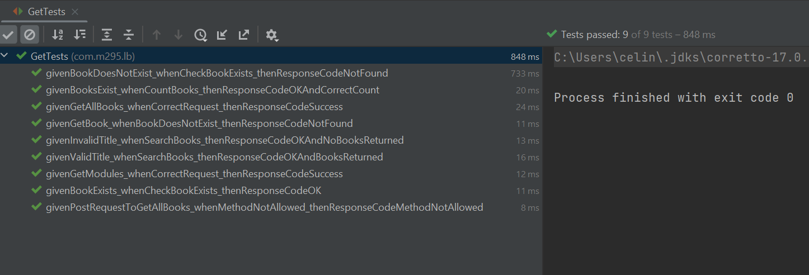
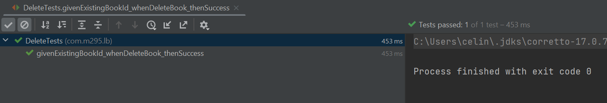
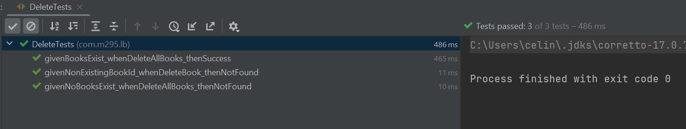
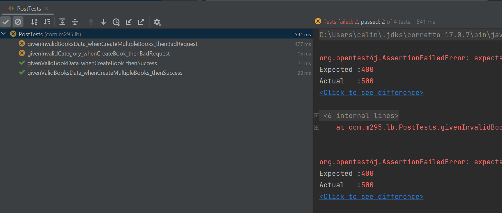
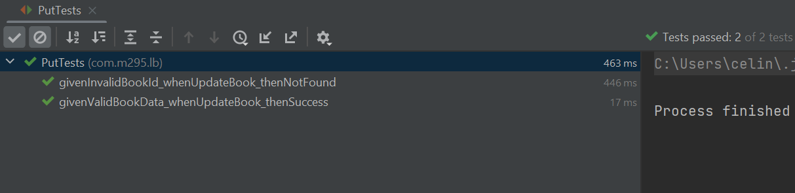

# SmartLibrary | M295-LB
## Beschreibung
**SmartLibrary** ist ein Bibliotheksverwaltungssystem. Es ermöglicht das Verwalten von Büchern und unterstützt alle Kernprozesse von der Ausleihe bis zur Rückgabe. 
Das System vereinfacht auch die Verwaltung von Nutzerdaten. 
Ziel ist es, die Bibliotheksnutzung effizienter zu gestalten und die administrativen Aufgaben zu reduzieren.

# Visuals
## Datenbankdiagramm


## Klassendiagramm


## Screenshots vom Testing
### Positive / Negative Get-Tests


### Positive / Negative Delete-Tests



### Positive / Negative Post-Tests


### Positive / Negative Put-Tests


### Boundary conditions BookController-Tests


## Validierungsregeln für Buch-Entität
### 1. `publicationDate`
- **Regel**: Das Veröffentlichungsdatum darf nicht in der Vergangenheit liegen.
- **Implementierung**: Verwendet die Annotation `@FutureOrPresent`, um sicherzustellen, dass das Datum entweder heute oder in der Zukunft liegt.
- **Fehlermeldung**: „Das Veröffentlichungsdatum muss heute oder in der Zukunft liegen.“

### 2. `category`
- **Regel**: Die Kategorie des Buches muss den vordefinierten Kategorien entsprechen.
- **Implementierung**: Verwendet die Annotation `@Pattern` mit einem regulären Ausdruck, der nur auf bestimmte Kategorienamen passt.
- **Fehlermeldung**: „Kategorie muss eine der folgenden sein: Belletristik, Sachbuch, Science Fiction, Biographie, Geschichte, Kinder.“

### 3. `title`
- **Regel**: Der Titel muss zwischen 3 und 100 Zeichen lang sein.
- **Implementierung**: Verwendet die Annotation `@Size`, um Mindest- und Höchstlängenbeschränkungen durchzusetzen.
- **Fehlermeldung**: „Der Titel muss zwischen 3 und 100 Zeichen lang sein.“

### Verwendung im Service Layer


# Berechtigungsmatrix für die Book-Service-Endpoints

Die folgende Matrix beschreibt die Zugriffsberechtigungen für die verschiedenen Endpunkte im `BookController`.

| Endpunkt                    | Beschreibung                                 | LIBRARIAN | GUEST |
|-----------------------------|---------------------------------------------|:-----:|:-----:|
| GET /library/all            | Abrufen aller Bücher                        |   ✔   |   ✔   |
| GET /library/{bookId}       | Abrufen eines Buches nach ID                |   ✔   |   ✔   |
| GET /library/exists/{bookId}| Überprüfen der Existenz eines Buches        |   ✔   |   ✔   |
| GET /library/count          | Zählen aller Bücher                         |   ✔   |   ✔   |
| GET /library/search         | Bücher nach Titel oder Veröffentlichungsdatum suchen | ✔ | ✔   |
| POST /library/create        | Erstellen eines neuen Buchdatensatzes       |   ✔   |   ✘   |
| POST /library/createMultiple| Erstellen mehrerer Buchdatensätze           |   ✔   |   ✘   |
| PUT /library/update/{bookId}| Aktualisieren eines Buchdatensatzes         |   ✔   |   ✘   |
| DELETE /library/{bookId}    | Löschen eines Buchdatensatzes               |   ✔   |   ✘   |
| DELETE /library/all         | Löschen aller Bücher                        |   ✔   |   ✘   |

## Rollendefinitionen
- **LIBRARIAN**: Bibilothekaren haben Vollzugriff auf alle Endpunkte, einschließlich Erstellung, Aktualisierung und Löschung von Buchdatensätzen.
- **GUEST**: Gäste haben ausschließlich Lesezugriff und können keine Daten erstellen, aktualisieren oder löschen.


### OpenAPI Dokumentation der Services
```yaml
openapi: "3.0.0"
info:
  version: "1"
  title: "SmartLibrary"
  description: "Application to keep track of books and who lend them"
paths:
  /artifact/resources/library/all:
    delete:
      operationId: "deleteAllBooks"
      description: "Deletes all books from the DB"
      parameters: []
      requestBody:
        content:
          application/json:
            schema:
              type: "string"
      responses:
        200:
          description: ""
          content:
            application/json:
              schema:
                type: "string"
        400:
          description: ""
          content:
            application/json:
              schema:
                type: "string"
        404:
          description: ""
          content:
            application/json:
              schema:
                type: "string"
        500:
          description: ""
          content:
            application/json:
              schema:
                type: "string"
    get:
      operationId: "getAllBooks"
      description: "Gets all the books from the DB"
      parameters: []
      responses:
        200:
          description: ""
          content:
            application/json:
              schema:
                type: "string"
        500:
          description: ""
          content:
            application/json:
              schema:
                type: "string"
  /artifact/resources/library/{bookId}:
    get:
      operationId: "getBookById"
      description: "Gets book by ID"
      parameters:
        - in: "path"
          name: "bookId"
          required: true
          schema:
            type: "integer"
      responses:
        200:
          description: "Successful retrieval of the book"
          content:
            application/json:
              schema:
                type: "string"
        404:
          description: "Book not found"
          content:
            application/json:
              schema:
                type: "string"
        500:
          description: "Internal server error"
          content:
            application/json:
              schema:
                type: "string"
  /artifact/resources/library/exists/{bookId}:
    get:
      operationId: "checkBookExists"
      description: "Checks if the book exists in db"
      parameters:
        - in: "path"
          name: "bookId"
          required: true
          schema:
            type: "integer"
      responses:
        200:
          description: "Book exists"
          content:
            application/json:
              schema:
                type: "string"
        404:
          description: "Book not found"
          content:
            application/json:
              schema:
                type: "string"
  /artifact/resources/library/count:
    get:
      operationId: "countBooks"
      description: "Counts all the books in the DB"
      parameters: []
      responses:
        200:
          description: ""
          content:
            application/json:
              schema:
                type: "string"
        500:
          description: ""
          content:
            application/json:
              schema:
                type: "string"
  /artifact/resources/library/search:
    get:
      operationId: "getBooksByTitleOrPublicationDate"
      description: "Gets books by title and or publicationDate search"
      parameters:
        - in: "query"
          name: "publicationDate"
          schema:
            type: "string"
        - in: "query"
          name: "title"
          schema:
            type: "string"
      responses:
        200:
          description: ""
          content:
            application/json:
              schema:
                type: "string"
        500:
          description: ""
          content:
            application/json:
              schema:
                type: "string"
  /artifact/resources/library/create:
    post:
      operationId: "createBook"
      description: "Creates one book"
      parameters:
        - in: "query"
          name: "author"
          schema:
            type: "string"
        - in: "query"
          name: "availability"
          schema:
            type: "boolean"
        - in: "query"
          name: "category"
          schema:
            type: "string"
        - in: "query"
          name: "lendingId"
          schema:
            type: "integer"
        - in: "query"
          name: "price"
          schema:
            type: "integer"
        - in: "query"
          name: "publicationDate"
          schema:
            type: "string"
        - in: "query"
          name: "title"
          schema:
            type: "string"
      requestBody:
        content:
          application/json:
            schema:
              type: "string"
      responses:
        200:
          description: ""
          content:
            application/json:
              schema:
                type: "string"
        404:
          description: ""
          content:
            application/json:
              schema:
                type: "string"
        500:
          description: ""
          content:
            application/json:
              schema:
                type: "string"
  /artifact/resources/library/createMultiple:
    post:
      operationId: "createBooks"
      description: "Creates more than one book"
      parameters:
        - in: "query"
          name: "author"
          schema:
            type: "string"
        - in: "query"
          name: "availability"
          schema:
            type: "boolean"
        - in: "query"
          name: "category"
          schema:
            type: "string"
        - in: "query"
          name: "lendingId"
          schema:
            type: "integer"
        - in: "query"
          name: "price"
          schema:
            type: "integer"
        - in: "query"
          name: "publicationDate"
          schema:
            type: "string"
        - in: "query"
          name: "title"
          schema:
            type: "string"
      requestBody:
        content:
          application/json:
            schema:
              type: "string"
      responses:
        200:
          description: ""
          content:
            application/json:
              schema:
                type: "string"
        404:
          description: ""
          content:
            application/json:
              schema:
                type: "string"
        500:
          description: ""
          content:
            application/json:
              schema:
                type: "string"
  /artifact/resources/library/update/{bookId}:
    put:
      operationId: "updateBook"
      description: "Updates a book with new values"
      parameters:
        - in: "path"
          name: "bookId"
          required: true
          schema:
            type: "integer"
        - in: "query"
          name: "author"
          schema:
            type: "string"
        - in: "query"
          name: "availability"
          schema:
            type: "boolean"
        - in: "query"
          name: "category"
          schema:
            type: "string"
        - in: "query"
          name: "lendingId"
          schema:
            type: "integer"
        - in: "query"
          name: "price"
          schema:
            type: "integer"
        - in: "query"
          name: "publicationDate"
          schema:
            type: "string"
        - in: "query"
          name: "title"
          schema:
            type: "string"
      requestBody:
        content:
          application/json:
            schema:
              type: "string"
      responses:
        200:
          description: ""
          content:
            application/json:
              schema:
                type: "string"
        400:
          description: ""
          content:
            application/json:
              schema:
                type: "string"
        404:
          description: ""
          content:
            application/json:
              schema:
                type: "string"
        500:
          description: ""
          content:
            application/json:
              schema:
                type: "string"
  /artifact/resources/library/:
    delete:
      operationId: "deleteBook"
      description: "Deletes one book from DB"
      parameters:
        - in: "path"
          name: "bookId"
          required: true
          schema:
            type: "integer"
      requestBody:
        content:
          application/json:
            schema:
              type: "string"
      responses:
        200:
          description: ""
          content:
            application/json:
              schema:
                type: "string"
        204:
          description: ""
          content:
            application/json:
              schema:
                type: "string"
        404:
          description: ""
          content:
            application/json:
              schema:
                type: "string"
        500:
          description: ""
          content:
            application/json:
              schema:
                type: "string"
components:
  securitySchemes: {}
  schemas: {}

```


# SQL-Script
```sql
DROP DATABASE IF EXISTS Library;
CREATE DATABASE Library;
USE Library;

-- Zuerst die Tabelle Lending erstellen
CREATE TABLE Lending(
    Lending_ID INT PRIMARY KEY AUTO_INCREMENT, 
    Name_Borrower VARCHAR(64)
);

-- Dann die Tabelle Book erstellen, die einen Fremdschlüssel auf Lending hat
CREATE TABLE Book(
    Book_ID INT PRIMARY KEY AUTO_INCREMENT, 
    Title VARCHAR(64),
    Author VARCHAR(64),
    Publication_Date DATE,
    Category VARCHAR(64),
    Availability BOOLEAN,
    Price DOUBLE(10,2),
    Lending_ID INT,
    FOREIGN KEY (Lending_ID) REFERENCES Lending(Lending_ID)
);
```

# Zusammenfassung


# Autor
## Céline Kölbl
